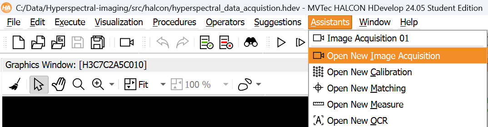
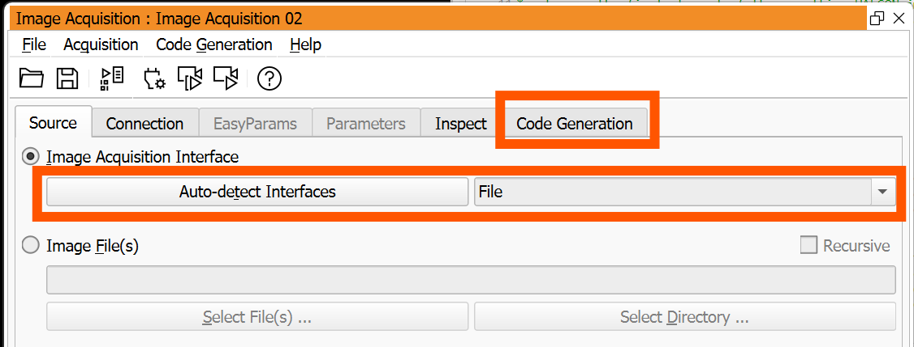
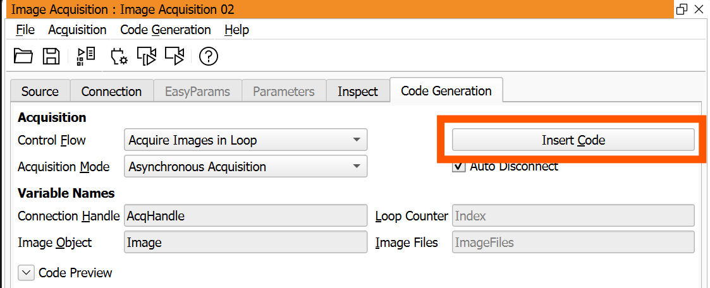
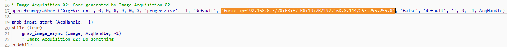

# Hyperspectral Imaging Using HALCON with HDevelop

This package utilizes HDevelop 24.04 Progress for data acquisition, inspection, and training. HDevelop is the default IDE of HALCON, a computer vision library. The package has been tested with the Specim FX10 and Specim FX17 hyperspectral cameras.

## Installations

This code works exclusively with HDevelop. HDevelop is not free but can be accessed for a limited time using a student license. You can request a student license at [MVTec on Campus](https://www.mvtec.com/company/mvtec-on-campus/licenses/student). After your request is reviewed, activate the HALCON license using the initial email you received after signing up.

The interface required for image acquisition is called GigE Vision. After completing the HDevelop installation, you can install the additional interface for acquisition from [MVTec Documentation](https://www.mvtec.com/products/interfaces/documentation/view/1305-standard-13-mvtecdoc-gigevision2).

## File Guide

### hyperspectral_image_acquisition.hdev

This script is for image acquisition. Connect the hyperspectral camera to the PC and adjust the following settings accordingly:

- IP address of the camera
- Paths where images will be saved
- Frame rate of the camera (should match the moving speed of the camera)
- Height of the image (duration of acquisition)
- File extension (use `write_object` for HOBJ or `write_image` for TIFF)

To change the IP address easily, click on `Assistants` in the menu bar, then click on `Open New Image Acquisition`.

Then click on `Auto-detect Interfaces`, which should show a GigE Vision2 device if the camera is connected correctly. Afterwards, go to `Code Generation`.

In Code Generation, click on `Insert Code`.

The following code will be generated. The only line you need is the one with the IP address of the camera. After replacing that line, the rest of the generated code can be deleted.

When running the code, it will first ask you to place the white reference in front of the camera. Press F5 or the run button when this is done. Next, it will ask for the dark reference. Place the lid on the camera and press F5 or the run button. Now it will enter a loop where it can acquire images. Every time the run button is pressed, it will take a picture, apply the dark and white reference, and save the image. The white and dark references are also saved in case there's a need to revert the calibration.

### inspect_pixels.hdev

This program inspects pixels of hyperspectral images. It opens an image, and the user can click on a pixel to plot a graph of the values of each channel of that pixel.

### model_training.hdev

This program trains a model using a hyperspectral dataset. However, we recommend using our Python notebooks for training models.

### tiff.hdev

This program converts images from HOBJ extension to TIFF. HOBJ is more space-efficient but can only be used in HALCON, while TIFF is widely supported but can be significantly larger for large datasets.

## Recommendation

With our current setup, HALCON is only needed for image acquisition. To align with our goal of being fully open source, we recommend using an open-source platform that supports GigE Vision, which is the only requirement to acquire images from the Specim FX10/FX17 camera. An example is [Aravis Project](https://github.com/AravisProject/aravis).
